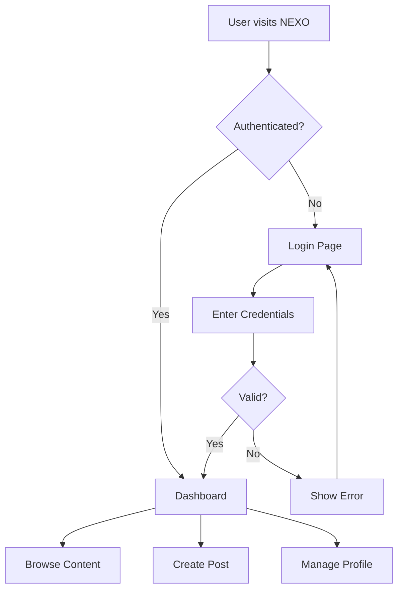
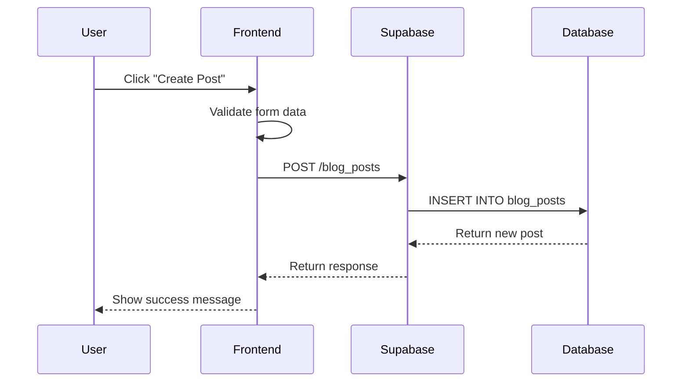
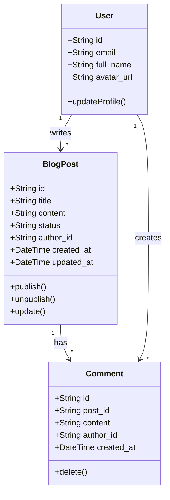
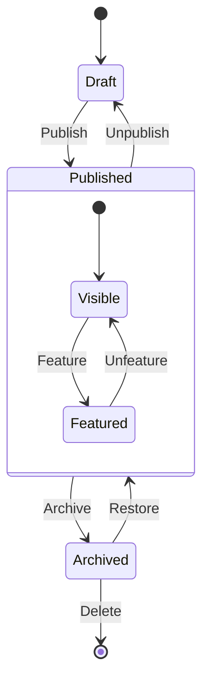
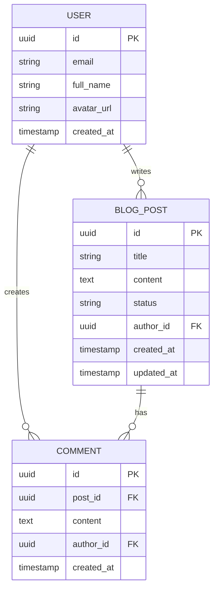
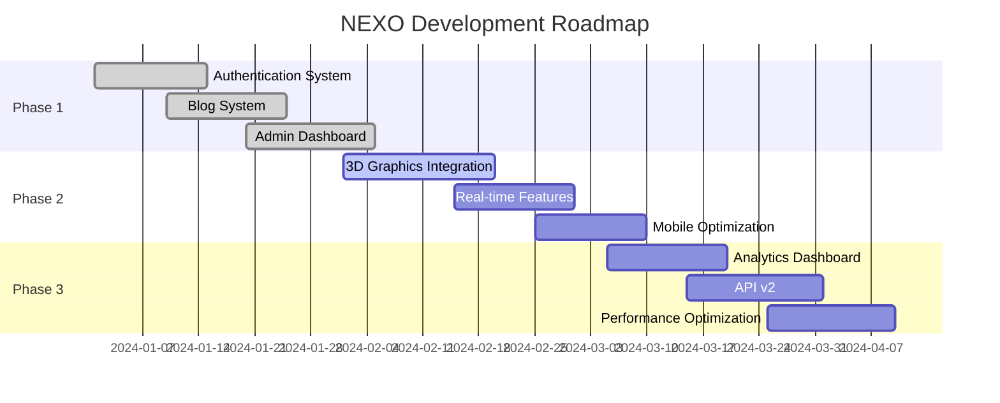
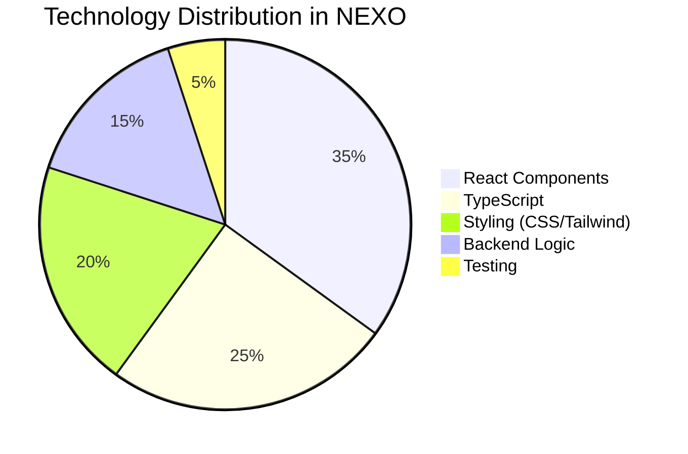
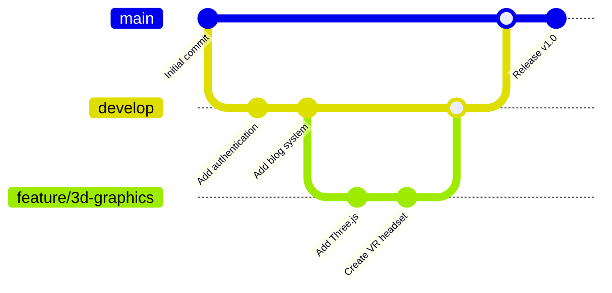
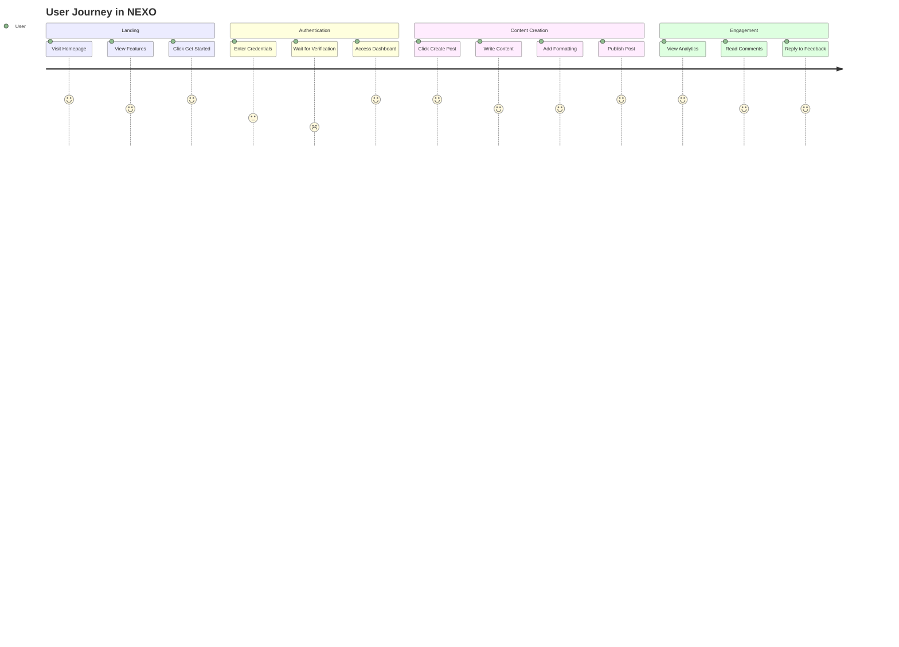

# Mermaid Diagram Examples

This page demonstrates various Mermaid diagrams that you can use in your documentation.

## Flow Chart

## Sequence Diagram

## Class Diagram

## State Diagram

## Entity Relationship Diagram

## Gantt Chart

## Pie Chart

## Git Graph

## Journey Map

## Tips for Using Mermaid

1. **Keep it Simple**: Don't overcomplicate diagrams
2. **Use Clear Labels**: Make node labels descriptive
3. **Choose the Right Type**: Select diagram type based on what you're explaining
4. **Test Rendering**: Always preview your diagrams
5. **Responsive Design**: Consider how diagrams look on mobile devices