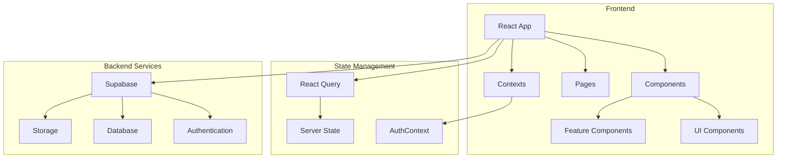
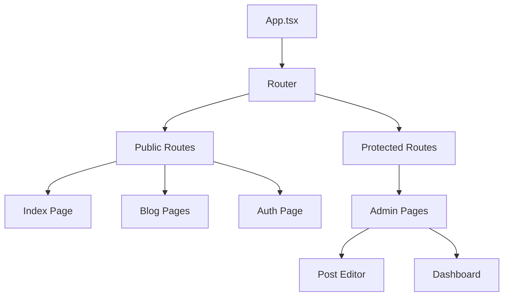
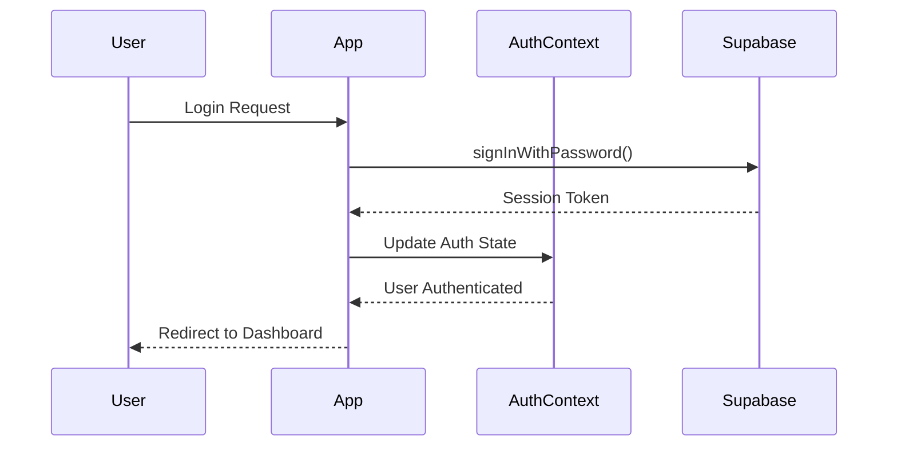
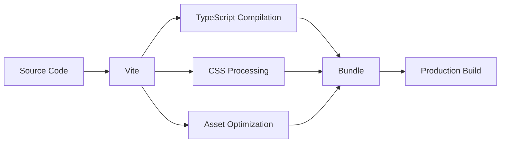

# Architecture

NEXO follows a modern, component-based architecture designed for scalability and maintainability.

## Overview



## Technology Stack

### Frontend

- **React 18**: UI library with hooks and concurrent features
- **TypeScript**: Type safety and better developer experience
- **Vite**: Fast build tool with HMR
- **Tailwind CSS**: Utility-first CSS framework
- **shadcn/ui**: High-quality React components

### Backend

- **Supabase**: Backend-as-a-Service
  - PostgreSQL database
  - Authentication & authorization
  - Real-time subscriptions
  - Storage for media files

### 3D Graphics

- **Three.js**: 3D graphics library
- **React Three Fiber**: React renderer for Three.js
- **@react-three/drei**: Useful helpers and abstractions

## Component Architecture

### Component Hierarchy



### Component Types

1. **Page Components** (`/pages`)
   - Route-level components
   - Handle data fetching
   - Compose feature components

2. **Feature Components** (`/components`)
   - Business logic components
   - Reusable across pages
   - Examples: `Header`, `Footer`, `PostEditor`

3. **UI Components** (`/components/ui`)
   - Pure presentational components
   - From shadcn/ui library
   - Examples: `Button`, `Card`, `Dialog`

## Data Flow

### Authentication Flow



### Data Fetching Pattern

We use React Query for server state management:

```typescript
// Custom hook for fetching posts
export function usePosts() {
  return useQuery({
    queryKey: ['posts'],
    queryFn: async () => {
      const { data, error } = await supabase
        .from('blog_posts')
        .select('*')
        .order('created_at', { ascending: false })
      
      if (error) throw error
      return data
    }
  })
}
```

## Security

### Row Level Security (RLS)

All database tables use RLS policies:

```sql
-- Public can read published posts
CREATE POLICY "Public posts are viewable by everyone" 
ON blog_posts FOR SELECT 
USING (status = 'published');

-- Authors can update their own posts
CREATE POLICY "Authors can update own posts" 
ON blog_posts FOR UPDATE 
USING (auth.uid() = author_id);
```

### Environment Variables

Sensitive configuration is stored in environment variables:

- `VITE_SUPABASE_URL`: Supabase project URL
- `VITE_SUPABASE_ANON_KEY`: Public anonymous key

## Performance Optimizations

### Code Splitting

Routes are lazy-loaded for optimal bundle sizes:

```typescript
const AdminPage = lazy(() => import('./pages/admin/AdminPage'))
```

### Image Optimization

- Lazy loading for images
- WebP format support
- Responsive image sizes

### Caching Strategy

- React Query for intelligent caching
- Stale-while-revalidate pattern
- Optimistic updates for better UX

## Development Workflow

### Directory Structure

```
src/
├── components/       # Reusable components
│   ├── admin/       # Admin-specific components
│   └── ui/          # UI library components
├── contexts/        # React contexts
├── hooks/           # Custom hooks
├── lib/             # Utilities and configs
├── pages/           # Route components
├── types/           # TypeScript definitions
└── test/            # Test utilities
```

### Testing Strategy

- Unit tests with Vitest
- Component testing with React Testing Library
- E2E tests for critical user flows

### Build Process

