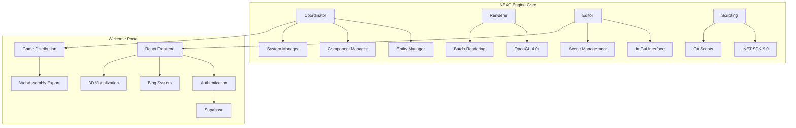
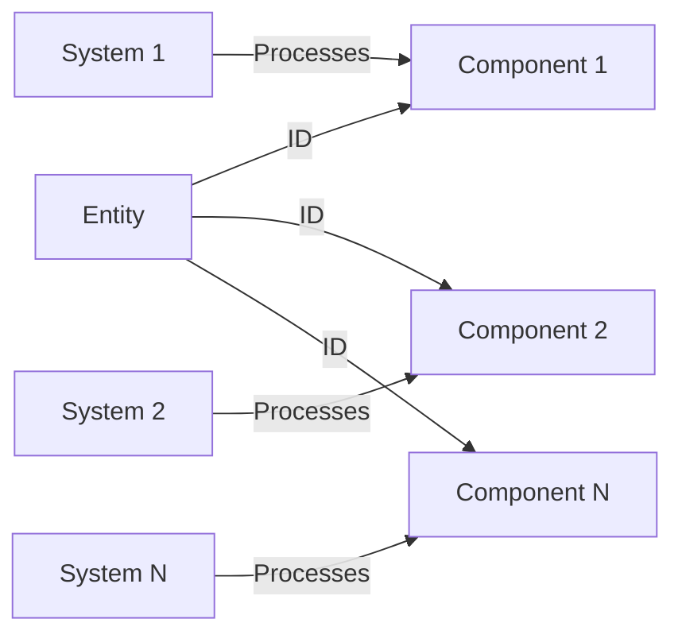
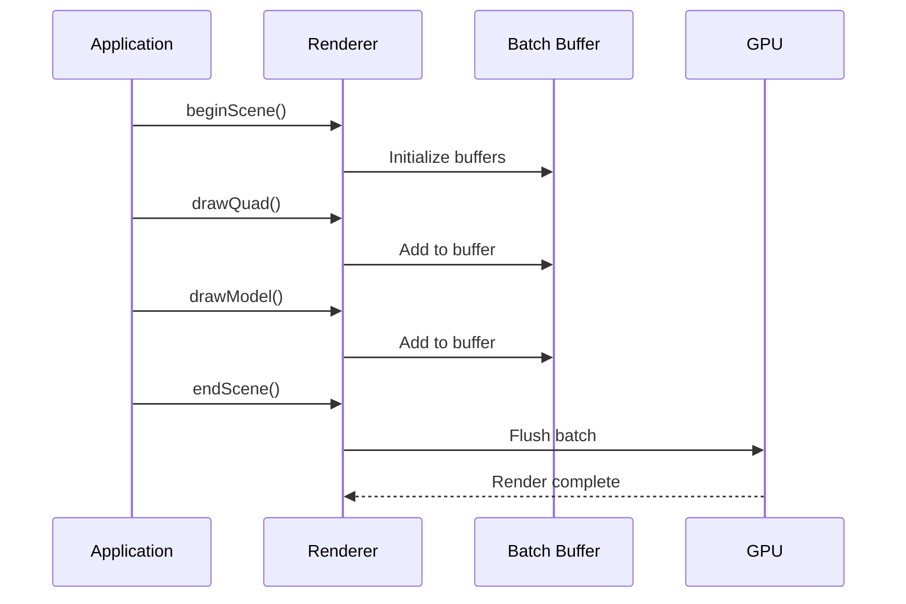
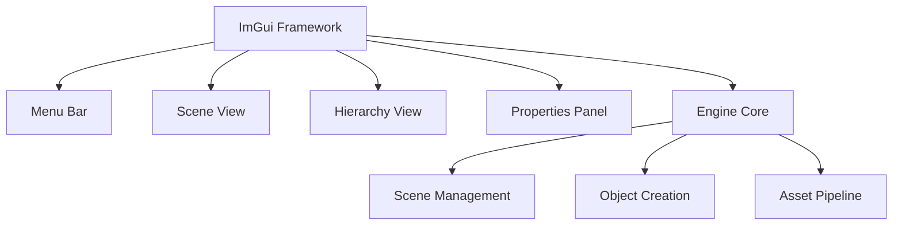
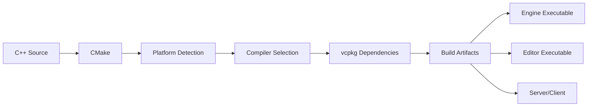

# Architecture

NEXO Engine follows a modern Entity Component System (ECS) architecture combined with a web-based Welcome Portal for game distribution and community engagement.

## System Overview



## Technology Stack

### NEXO Engine (C++)

- **Core Architecture**: Entity Component System (ECS)
- **Graphics**: OpenGL 4.0+ with batch rendering
- **UI Framework**: Dear ImGui for editor interface
- **Build System**: CMake 3.28+ with vcpkg
- **Scripting**: .NET SDK 9.0 for C# support
- **Dependencies**: Raylib 5.0, Boost

### Welcome Portal (Web)

- **Frontend**: React 18 with TypeScript
- **Build Tool**: Vite with HMR
- **Styling**: Tailwind CSS + shadcn/ui
- **Backend**: Supabase (PostgreSQL, Auth, Storage)
- **3D Graphics**: Three.js with React Three Fiber
- **Documentation**: VitePress with Mermaid support

## Entity Component System (ECS)

### Core Concepts



### ECS Components

1. **Entities**: Unique identifiers for game objects
2. **Components**: Pure data containers (position, velocity, health)
3. **Systems**: Logic processors that act on entities with specific components

### Key Managers

- **Coordinator**: Central orchestrator for all ECS operations
- **EntityManager**: Handles entity lifecycle and signatures
- **ComponentManager**: Type-safe component storage and retrieval
- **SystemManager**: Coordinates system execution and entity filtering

## Rendering Architecture

### Batch Rendering System



### Rendering Features

- **OpenGL 4.0+**: Modern graphics API support
- **Batch Rendering**: Minimizes draw calls per frame
- **Indexed Drawing**: Efficient vertex data usage
- **Shader System**: Default "Uber shader" with customization planned
- **Lighting**: Support for 8 directional and 8 point lights

## Editor Architecture

The NEXO Editor is built using the engine itself:



## Security

### Row Level Security (RLS)

All database tables use RLS policies:

```sql
-- Public can read published posts
CREATE POLICY "Public posts are viewable by everyone" 
ON blog_posts FOR SELECT 
USING (status = 'published');

-- Authors can update their own posts
CREATE POLICY "Authors can update own posts" 
ON blog_posts FOR UPDATE 
USING (auth.uid() = author_id);
```

### Environment Variables

Sensitive configuration is stored in environment variables:

- `VITE_SUPABASE_URL`: Supabase project URL
- `VITE_SUPABASE_ANON_KEY`: Public anonymous key

## Performance Optimizations

### Engine Performance

- **ECS Architecture**: Cache-friendly data layout
- **Batch Rendering**: Reduced GPU state changes
- **Component Pools**: Memory-efficient allocation
- **System Parallelization**: Multi-threaded system execution

### Portal Performance

- **Code Splitting**: Lazy-loaded routes for optimal bundles
- **React Query**: Intelligent caching with stale-while-revalidate
- **Image Optimization**: WebP format, lazy loading, responsive sizes
- **Bundle Optimization**: Tree shaking and minification

## Project Structure

### NEXO Engine Structure

```
game-engine/
├── src/
│   ├── core/         # ECS implementation
│   ├── renderer/     # OpenGL rendering
│   ├── editor/       # ImGui editor
│   ├── scripting/    # C# integration
│   └── physics/      # Physics engine
├── assets/           # Game assets
├── scripts/          # C# scripts
└── tests/            # Google Test suite
```

### Welcome Portal Structure

```
welcome-portal/
├── src/
│   ├── components/   # React components
│   ├── pages/        # Route pages
│   ├── contexts/     # React contexts
│   ├── hooks/        # Custom hooks
│   └── lib/          # Utilities
├── docs/             # VitePress documentation
└── public/           # Static assets
```

## Build & Deployment

### Engine Build Process



### CI/CD Pipeline

- **GitHub Actions**: Automated builds and tests
- **SonarCloud**: Code quality monitoring
- **Platform Support**: Windows, Linux, macOS builds
- **Package Generation**: NSIS installer (Windows), DEB package (Linux)