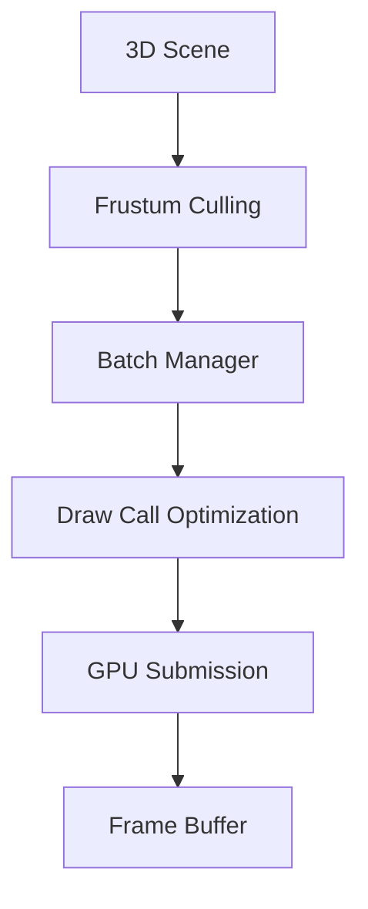
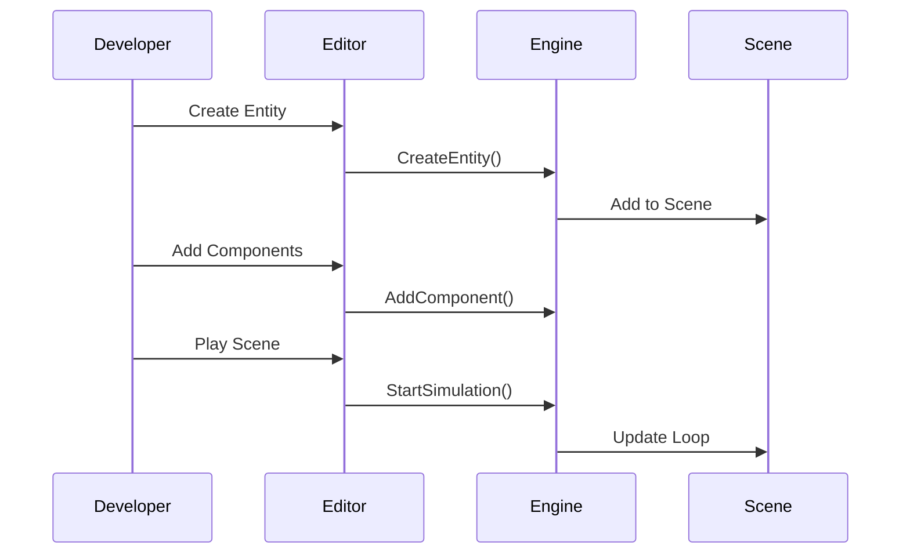
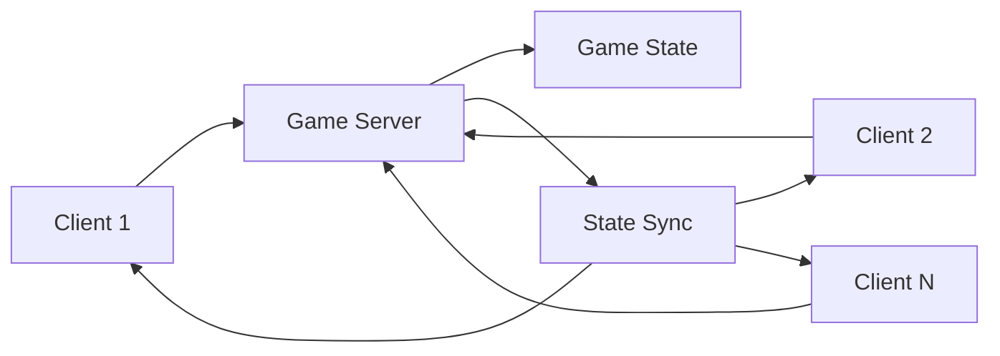

# Engine Features

NEXO Engine provides a comprehensive set of features for modern game development.

## Entity Component System (ECS)

The heart of NEXO Engine is its efficient Entity Component System implementation.

### Core Benefits

- **Performance**: Cache-friendly data layout for optimal CPU utilization
- **Flexibility**: Mix and match components to create any game object
- **Maintainability**: Clear separation between data and logic

### Example Usage

```cpp
// Create an entity
Entity player = coordinator.CreateEntity();

// Add components
coordinator.AddComponent<Transform>(player, {0.0f, 0.0f, 0.0f});
coordinator.AddComponent<Velocity>(player, {1.0f, 0.0f, 0.0f});
coordinator.AddComponent<Health>(player, {100});

// Register a movement system
auto movementSystem = coordinator.RegisterSystem<MovementSystem>();
Signature signature;
signature.set(coordinator.GetComponentType<Transform>());
signature.set(coordinator.GetComponentType<Velocity>());
coordinator.SetSystemSignature<MovementSystem>(signature);
```

## Rendering System

### 2D Rendering

- **Sprite Batching**: Efficient rendering of thousands of sprites
- **Texture Atlas Support**: Reduced texture switching
- **Transform Hierarchy**: Parent-child relationships
- **Animation System**: Sprite sheet animations

### 3D Rendering

- **Model Loading**: Support for common 3D formats
- **Material System**: PBR materials (planned)
- **Lighting**: Directional and point lights
- **Shadow Mapping**: Real-time shadows (planned)



## Integrated Editor

The NEXO Editor provides a complete development environment:

### Features

- **Scene View**: Real-time scene preview and editing
- **Hierarchy Panel**: Organize game objects
- **Properties Inspector**: Component editing
- **Asset Browser**: Manage game resources
- **Console**: Debug output and commands

### Workflow



## C# Scripting

Extend your game logic with C# scripts:

```csharp
using Nexo.Engine;

public class PlayerController : MonoBehaviour
{
    public float speed = 5.0f;
    private Transform transform;
    
    void Start()
    {
        transform = GetComponent<Transform>();
    }
    
    void Update()
    {
        float horizontal = Input.GetAxis("Horizontal");
        float vertical = Input.GetAxis("Vertical");
        
        Vector3 movement = new Vector3(horizontal, 0, vertical);
        transform.position += movement * speed * Time.deltaTime;
    }
}
```

### Scripting Features

- **Hot Reload**: Modify scripts without restarting
- **.NET 9.0**: Latest C# language features
- **Engine API**: Full access to engine systems
- **Visual Studio Integration**: IntelliSense support

## Physics Engine

Advanced physics simulation capabilities:

- **Rigid Body Dynamics**: Realistic object movement
- **Collision Detection**: Broad and narrow phase
- **Constraints**: Joints and motors
- **Triggers**: Volume-based events

## Networking

Built-in networking for multiplayer games:

### Architecture



### Features

- **Client-Server Architecture**: Authoritative server
- **State Synchronization**: Automatic replication
- **Lag Compensation**: Client-side prediction
- **Network Optimization**: Delta compression

## Asset Pipeline

Efficient asset management system:

- **Hot Reloading**: Update assets without restart
- **Asset Compression**: Optimized file sizes
- **Texture Streaming**: Load textures on demand
- **Audio System**: 3D spatial audio

## Platform Support

### Desktop Platforms
- **Windows**: Full support with MSVC
- **Linux**: GCC/Clang support
- **macOS**: Native Metal support (planned)

### VR Support
- **OpenXR**: Cross-platform VR
- **Hand Tracking**: Natural interactions
- **Room-Scale**: Full movement support

## Performance Tools

### Profiling
- **CPU Profiler**: Identify bottlenecks
- **GPU Profiler**: Render timing
- **Memory Profiler**: Track allocations

### Debug Visualization
- **Collision Shapes**: Visual debugging
- **Performance Graphs**: Real-time metrics
- **Component Inspector**: Runtime inspection

## Future Roadmap

### Planned Features
- **Vulkan Renderer**: Modern graphics API
- **Mobile Support**: iOS and Android
- **Cloud Saves**: Cross-platform progression
- **Mod Support**: User-generated content
- **AI Navigation**: Pathfinding system
- **Particle System**: Visual effects

### Community Features
- **Workshop Integration**: Share creations
- **Multiplayer Lobby**: Matchmaking
- **Leaderboards**: Global rankings