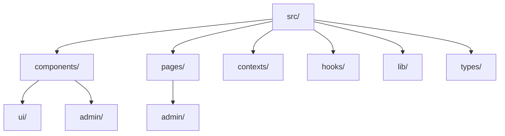

# Getting Started

Welcome to NEXO! This guide will help you get up and running with the Welcome Portal.

## Prerequisites

Before you begin, make sure you have the following installed:

- [Node.js](https://nodejs.org/) (v18 or higher)
- [Yarn](https://yarnpkg.com/) (v1.22 or higher)
- A [Supabase](https://supabase.com/) account

## Installation

### 1. Clone the Repository

```bash
git clone https://github.com/nexo/welcome-portal.git
cd welcome-portal
```

### 2. Install Dependencies

```bash
yarn install
```

### 3. Environment Setup

Create a `.env` file in the root directory:

```bash
cp .env.example .env
```

Add your Supabase credentials:

```env
VITE_SUPABASE_URL=your_supabase_url
VITE_SUPABASE_ANON_KEY=your_supabase_anon_key
```

### 4. Database Setup

Run the following SQL in your Supabase dashboard to create the necessary tables:

```sql
-- Create blog posts table
CREATE TABLE blog_posts (
  id UUID DEFAULT gen_random_uuid() PRIMARY KEY,
  title TEXT NOT NULL,
  content TEXT NOT NULL,
  status TEXT DEFAULT 'draft',
  author_id UUID REFERENCES auth.users(id),
  created_at TIMESTAMP WITH TIME ZONE DEFAULT NOW(),
  updated_at TIMESTAMP WITH TIME ZONE DEFAULT NOW()
);

-- Create comments table
CREATE TABLE comments (
  id UUID DEFAULT gen_random_uuid() PRIMARY KEY,
  post_id UUID REFERENCES blog_posts(id) ON DELETE CASCADE,
  content TEXT NOT NULL,
  author_id UUID REFERENCES auth.users(id),
  created_at TIMESTAMP WITH TIME ZONE DEFAULT NOW()
);

-- Enable Row Level Security
ALTER TABLE blog_posts ENABLE ROW LEVEL SECURITY;
ALTER TABLE comments ENABLE ROW LEVEL SECURITY;
```

## Development

Start the development server:

```bash
yarn dev
```

The application will be available at `http://localhost:8887`.

## Project Structure



## Key Features

### Authentication

NEXO uses Supabase Auth for user authentication:

```typescript
import { supabase } from '@/lib/supabase'

// Sign up
const { data, error } = await supabase.auth.signUp({
  email: 'user@example.com',
  password: 'password'
})

// Sign in
const { data, error } = await supabase.auth.signInWithPassword({
  email: 'user@example.com',
  password: 'password'
})
```

### Blog System

The blog system supports:
- Creating and editing posts
- Draft/Published status
- Markdown with syntax highlighting
- Comments

### 3D Graphics

NEXO includes 3D capabilities with Three.js:

```typescript
import { Canvas } from '@react-three/fiber'
import { VRHeadset } from '@/components/VRHeadset'

function Scene() {
  return (
    <Canvas>
      <VRHeadset />
    </Canvas>
  )
}
```

## Next Steps

- Explore the [Architecture Guide](/guide/architecture)
- Check out the [API Reference](/api/)
- See [Examples](/examples/diagrams) for more advanced usage