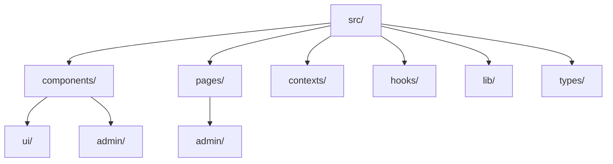

# Getting Started

Welcome to NEXO Engine! This guide covers setting up both the game engine and the Welcome Portal.

## Prerequisites

### For NEXO Engine

- **CMake** 3.28 or higher
- **C++ Compiler**: GCC/Clang (Linux/macOS) or MSVC (Windows)
- **Git** with submodule support
- **.NET SDK 9.0** for C# scripting
- **Dependencies**: Raylib 5.0, Boost (handled by vcpkg)

### For Welcome Portal

- **Node.js** v18 or higher
- **Yarn** v1.22 or higher
- **Supabase** account for backend services

## NEXO Engine Installation

### Windows Setup

1. Install Visual Studio with C++ development tools
2. Clone and build:

```bash
# Clone the repository
git clone https://github.com/NexoEngine/game-engine.git
cd game-engine

# Initialize submodules
git submodule init
git pull --recurse-submodules

# Setup vcpkg
.\vcpkg\bootstrap-vcpkg.bat
.\vcpkg\vcpkg integrate install

# Build the engine
cmake -B build
cmake --build build
```

### Linux/macOS Setup

```bash
# Clone the repository
git clone https://github.com/NexoEngine/game-engine.git
cd game-engine

# Initialize submodules
git submodule init
git pull --recurse-submodules

# Build with CMake preset (recommended)
cmake --workflow --preset=build-debug
```

### Running the Engine

```bash
# Run the game engine editor
./build/game_engine  # On Windows: build\game_engine.exe

# Run the server
./build/server      # On Windows: build\server.exe

# Run the client
./build/client      # On Windows: build\client.exe
```

## Welcome Portal Installation

### 1. Clone the Repository

```bash
git clone https://github.com/nexo/welcome-portal.git
cd welcome-portal
```

### 2. Install Dependencies

```bash
yarn install
```

### 3. Environment Setup

Create a `.env` file:

```bash
cp .env.example .env
```

Configure your Supabase credentials:

```env
VITE_SUPABASE_URL=your_supabase_url
VITE_SUPABASE_ANON_KEY=your_supabase_anon_key
```

### 4. Database Setup

Execute in your Supabase SQL editor:

```sql
-- Create blog posts table
CREATE TABLE blog_posts (
  id UUID DEFAULT gen_random_uuid() PRIMARY KEY,
  title TEXT NOT NULL,
  content TEXT NOT NULL,
  status TEXT DEFAULT 'draft',
  author_id UUID REFERENCES auth.users(id),
  created_at TIMESTAMP WITH TIME ZONE DEFAULT NOW(),
  updated_at TIMESTAMP WITH TIME ZONE DEFAULT NOW()
);

-- Create comments table
CREATE TABLE comments (
  id UUID DEFAULT gen_random_uuid() PRIMARY KEY,
  post_id UUID REFERENCES blog_posts(id) ON DELETE CASCADE,
  content TEXT NOT NULL,
  author_id UUID REFERENCES auth.users(id),
  created_at TIMESTAMP WITH TIME ZONE DEFAULT NOW()
);

-- Enable Row Level Security
ALTER TABLE blog_posts ENABLE ROW LEVEL SECURITY;
ALTER TABLE comments ENABLE ROW LEVEL SECURITY;
```

### 5. Start Development

```bash
# Start the web portal
yarn dev

# Start documentation server
yarn docs:dev
```

Portal available at: `http://localhost:8887`
Documentation at: `http://localhost:5173`

## Project Structure



## Key Features

### Authentication

NEXO uses Supabase Auth for user authentication:

```typescript
import { supabase } from '@/lib/supabase'

// Sign up
const { data, error } = await supabase.auth.signUp({
  email: 'user@example.com',
  password: 'password'
})

// Sign in
const { data, error } = await supabase.auth.signInWithPassword({
  email: 'user@example.com',
  password: 'password'
})
```

### Blog System

The blog system supports:
- Creating and editing posts
- Draft/Published status
- Markdown with syntax highlighting
- Comments

### 3D Graphics

NEXO includes 3D capabilities with Three.js:

```typescript
import { Canvas } from '@react-three/fiber'
import { VRHeadset } from '@/components/VRHeadset'

function Scene() {
  return (
    <Canvas>
      <VRHeadset />
    </Canvas>
  )
}
```

## Next Steps

- Explore the [Architecture Guide](/guide/architecture)
- Check out the [API Reference](/api/)
- See [Examples](/examples/diagrams) for more advanced usage