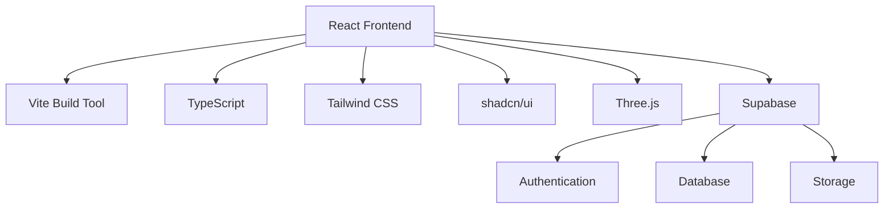

## Quick Start

Get up and running with NEXO in minutes:

```bash
# Clone the repository
git clone https://github.com/nexo/welcome-portal.git

# Install dependencies
yarn install

# Set up environment variables
cp .env.example .env

# Start development server
yarn dev
```

## Architecture Overview

NEXO is built with modern web technologies:



## Why NEXO?

NEXO provides a complete solution for building immersive web experiences with:

- **Developer Experience**: Hot module replacement, TypeScript support, and modern tooling
- **Performance**: Optimized builds with code splitting and lazy loading
- **Scalability**: Modular architecture that grows with your needs
- **Security**: Built-in authentication and security best practices