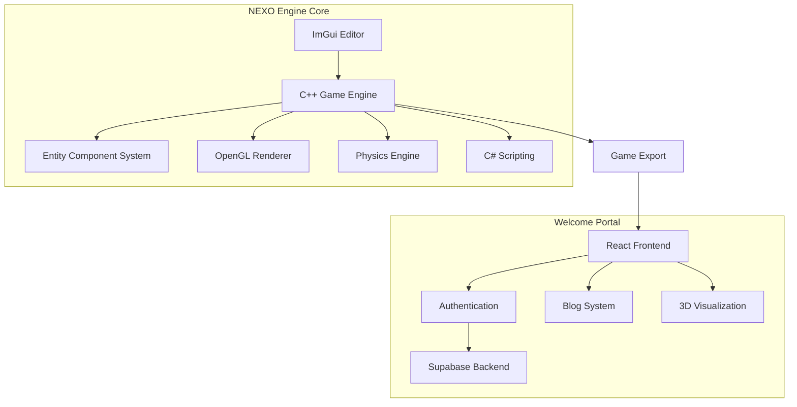

## Quick Start

### Engine Installation

```bash
# Clone the game engine repository
git clone https://github.com/NexoEngine/game-engine.git
cd game-engine

# Initialize submodules
git submodule init
git pull --recurse-submodules

# Build with CMake
cmake --workflow --preset=build-debug
```

### Welcome Portal Setup

```bash
# Clone the welcome portal
git clone https://github.com/nexo/welcome-portal.git
cd welcome-portal

# Install dependencies
yarn install

# Configure environment
cp .env.example .env

# Start development
yarn dev
```

## Architecture Overview

NEXO Engine combines a powerful C++ game engine with a modern web portal:



## Why NEXO Engine?

NEXO Engine is an innovative game development platform created by five EPITECH Strasbourg students:

- **Modern Architecture**: Entity Component System for flexible game development
- **Integrated Tools**: Built-in editor with scene management and object creation
- **Cross-Platform**: Desktop and VR support with optimized rendering
- **Open Source**: MIT licensed with active community development
- **Web Integration**: Welcome Portal for showcasing and distributing games